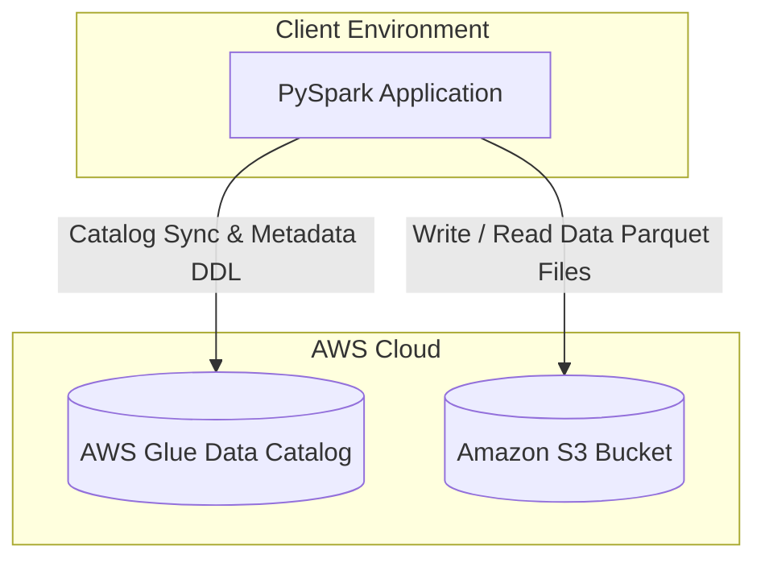

# AWS Hive vs. Apache Iceberg Table Features Demo

This repository contains a hands-on comparison demonstrating the features, capabilities, and limitations of traditional **Hive-style Parquet tables** versus **Apache Iceberg tables** on AWS. Both demos leverage **PySpark**, **AWS Glue Data Catalog** as the metastore, and **Amazon S3** as the storage layer.

---

## 🏗️ Architecture Overview

The demo shows how PySpark interacts with data stored in Amazon S3 while cataloging metadata in the AWS Glue Data Catalog:



---

## 📊 Feature Comparison Matrix

| Feature | Traditional Hive (Parquet) | Apache Iceberg (v2) |
| :--- | :--- | :--- |
| **Expression-Based Partitioning** | ❌ No (Requires explicit column and manual directory management) |  **Yes** (e.g., partition by `months(join_date)`) |
| **Schema Evolution (Rename)** | ❌ No (Renaming column fails / breaks compatibility) |  **Yes** (Safe renaming in metadata without rewriting files) |
| **Row-Level Updates (`UPDATE`)** | ❌ No (Requires overwriting the entire partition/table) |  **Yes** (Row-level ACID updates supported natively) |
| **Time Travel** | ❌ No (Cannot query past versions or snapshot history) |  **Yes** (Rollback and query by snapshot ID / timestamp) |
| **Partition Evolution** | ❌ No (Changing partition schema requires full table rewrite) |  **Yes** (Evolve partition layout on-the-fly without data rewrite) |
| **Metadata Querying** | ❌ No (Limited to `SHOW PARTITIONS` and system descriptions) |  **Yes** (Query `.partitions`, `.files`, and `.snapshots` catalogs) |
| **Native Compaction** | ❌ No (Must run custom external PySpark rewrite logic) |  **Yes** (Call system procedure `rewrite_data_files`) |

---

## 🛠️ Prerequisites & AWS Setup

To run these scripts using your AWS account, configure the environment as follows:

### 1. AWS Credentials Configuration
Ensure you have the AWS CLI installed and configured with your credentials:
```bash
aws configure
```
Make sure the IAM user or role has the following permissions:
- **S3 Access**: Read/Write/Delete permissions on the target S3 bucket (e.g., `s3:GetObject`, `s3:PutObject`, `s3:DeleteObject`, `s3:ListBucket`).
- **Glue Catalog Access**: Permissions to create databases, tables, and update partitions (e.g., `glue:CreateDatabase`, `glue:CreateTable`, `glue:GetTable`, `glue:UpdateTable`, `glue:BatchCreatePartition`).

### 2. S3 Warehouse Preparation
Create an S3 bucket (or use an existing one) to act as your data lake warehouse. Replace the bucket paths in the script constants:
* In `src/aws_hive_baseline_demo.py`:
  ```python
  S3_BUCKET = "s3://<your-aws-demo-bucket-name>/hive-warehouse/"
  ```
* In `src/aws_iceberg_demo.py`:
  ```python
  S3_BUCKET = "s3://<your-aws-demo-bucket-name>/iceberg-warehouse/"
  ```

### 3. Local Python Environment Setup
Create a virtual environment and install the required dependencies:
```bash
# Create and activate virtual environment
python3 -m venv .venv
source .venv/bin/activate

# Install dependencies
pip install -r requirements.txt
```

*Note: You must have **Apache Spark** installed locally, or run these scripts within an AWS EMR cluster, AWS Glue Job, or a Docker container configured with Spark and the required Iceberg/AWS bundles.*

---

## 💻 Running the Demos

### 1. Traditional Hive Table Demo (Baseline)
This script demonstrates the limitations of Hive-style partitioning, schema evolution, and file maintenance.

Run the baseline script:
```bash
python src/aws_hive_baseline_demo.py
```

**Key steps tested:**
1. **Creation**: Drops and creates a Hive table partitioned explicitly by `join_date`.
2. **Load**: Appends 10,000 mock records using `insertInto`.
3. **Partitioning Constraints**: Demonstrates that Hive has no system catalog tables for partitions.
4. **Schema Evolution Deficiencies**: Column additions pass, but column renaming fails:
   ```
   ❌ EXPECTED HIVE ERROR CAUGHT: Column rename failed as anticipated!
   ```
5. **Time Travel Deficiencies**: Reading past snapshots throws an exception.
6. **Partition Evolution Deficiencies**: Modifying partitioning strategy dynamically fails.
7. **Maintenance Deficiencies**: Fails to run Iceberg compaction procedures on a Hive table.

---

### 2. Apache Iceberg Table Demo
This script showcases the advanced features of Iceberg tables, showing how it solves the issues encountered in the Hive baseline.

Run the Iceberg script:
```bash
python src/aws_iceberg_demo.py
```

**Key steps tested:**
1. **Expression Partitioning**: Creates an Iceberg table partitioned by `months(join_date)` using format v2.
2. **Metadata Table Queries**: Directly queries system metadata catalogs:
   - `aws_glue.iceberg_demo.employee_demographics.partitions`
   - `aws_glue.iceberg_demo.employee_demographics.files`
   - `aws_glue.iceberg_demo.employee_demographics.snapshots`
3. **Schema Evolution & Row-Level Updates**: Renames columns in place without data rewriting, performs a row-level `UPDATE`, and appends new rows matching the evolved schema.
4. **Time Travel**: Leverages a snapshot ID from `.snapshots` metadata table to read the table state *before* updates and schema changes.
5. **Partition Evolution**: Dynamically transitions partition spec from monthly (`months(join_date)`) to daily (`days(join_date)`) on the fly, showing that new data follows the daily spec while old data stays untouched.
6. **Maintenance / Compaction**: Calls the system procedure `rewrite_data_files` to compact small files and sort records for query performance.

---

## 📂 Repository Structure

- `src/`
  - [aws_hive_baseline_demo.py](file:///Users/sathiya/Data-Engineering/hive-vs-iceberg-demo/src/aws_hive_baseline_demo.py): Python script demonstrating Hive-style parquet tables and their limitations.
  - [aws_iceberg_demo.py](file:///Users/sathiya/Data-Engineering/hive-vs-iceberg-demo/src/aws_iceberg_demo.py): Python script showcasing Apache Iceberg's ACID features and layout flexibility.
- `requirements.txt`: Python package dependencies (`boto3`, `pyathena`, `pandas`).
- `config/`: Configurations and environment setup workspace (empty placeholder).
- `notebooks/`: Jupyter Notebook workspace (empty placeholder).
